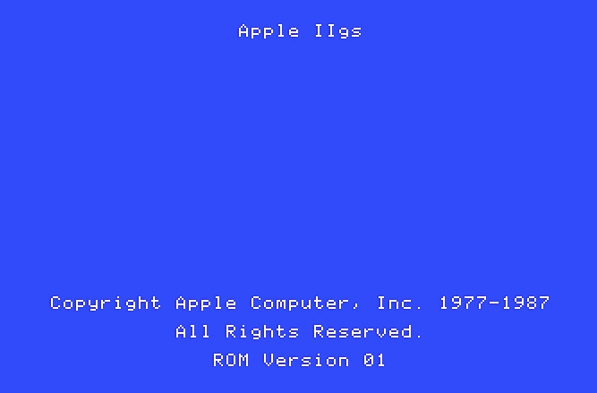

MiniMemoryTester

# mmt
A program designed to exhaustively test expansion memory on an Apple IIGS.

# Usage
There is a full manual here  http://goo.gl/NiKJTH

If you just want the program, the latest disk images are

   [MMT800.2mg](https://github.com/digarok/mmt/blob/master/MMT800.2mg?raw=true "MMT800.2mg")
   
   [MMT800.po](https://github.com/digarok/mmt/blob/master/MMT800.po?raw=true "MMT800.po")
   
   [MMT140.po](https://github.com/digarok/mmt/blob/master/MMT140.po?raw=true "MMT140.po")

You can transfer those to a 3.5" or 5.25" disk using ADT Pro or if you have a SD based storage system, it should run fine from there.  

# Build
You can build it yourself using the *make_bootable* Bash script under Linux or OSX.  It should be trivial to write an approximate BAT or Powershell for Windows, if that is what you are using.  Note - You need to edit the following lines in the *make_bootable* script:

    # SET THESE TOOLS UP ON YOUR SYSTEM AND UPDATE THE PATHS HERE TO BUILD
    CADIUS="../tools/Cadius"
    MERLIN="../tools/Merlin32_v1.0/MacOSX/Merlin32"

You will obviously also need those two tools on your system.  They are available here:

[Merlin32 - 65c816 Assembler](http://brutaldeluxe.fr/products/crossdevtools/merlin/index.html "Merlin32 ")

[CADIUS - Command line disk image tool](http://brutaldeluxe.fr/products/crossdevtools/cadius/index.html "CADIUS")

# About the code
## Historical Context:

This grew out of a much simpler memory tester I had thrown together earlier in 2015.  At one point, I started working with an Apple II hardware vendor to include their feedback as feature enhancements which eventually caused a large rewrite to support a more robust configuration.  There are some hacks and magic sprinkled in, but I tried to keep it pretty sane.  

Some of the code paths for the testing engine are a bit generic, at the expense of speed, but to make the code more managable (for me!)  Other parts are, perhaps, oddly organize but with a mind on keeping overall test loops relatively tight.  
Overall, this program favors configurability and reusable code, over speed.  There's also not much thought to stability, but I wanted to allow the user to try to test their RAM as they see fit.

## Technical Context:

Large portions of this program are written in one of the two cpu modes:

 **m=1** (short) **x=0** (long)

 _or_

 **m=0** (long) **x=0** (long)
 
The 8-bit test modes, in particular, are written with a short accumulator, but long index registers.  This way it can easily scan a bank of memory using the X register from 0000 to FFFF.  Likewise, when running 16-bit test modes, we write 16 bit values using a long accumulator, and still using long index registers.  However, we also increment or decrement by two, since it writes two bytes at a time with a long accumulator.

Again, see the manual at the top for the full description of the software and usage.  

